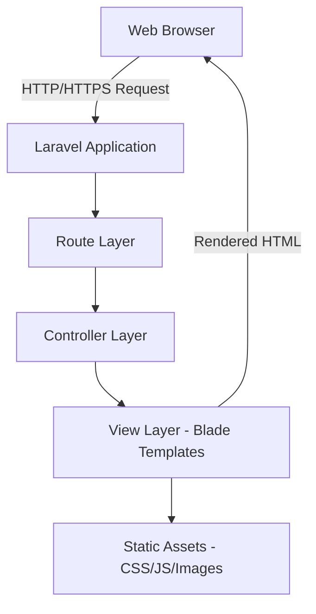

# Design Document: Smart Digital Creative Management & Resources Website

## Overview

The Smart Digital Creative Management & Resources website is a professional corporate website built with Laravel framework. The architecture follows Laravel's MVC pattern with a focus on clean separation between presentation, business logic, and data layers. The website implements a phased rollout strategy where the Home page is fully functional while other pages display maintenance placeholders.

The design emphasizes professional aesthetics with a white background theme, responsive layouts, and clear navigation. The website serves as the company's digital storefront, showcasing services and establishing credibility through proper branding and information architecture.

## Architecture

### High-Level Architecture



### Technology Stack

- **Backend Framework**: Laravel (latest stable version)
- **Templating Engine**: Blade
- **Frontend**: HTML5, CSS3, JavaScript
- **CSS Framework**: Tailwind CSS or Bootstrap (for responsive design)
- **Web Server**: Apache/Nginx with PHP-FPM
- **Protocol**: HTTPS with SSL/TLS

### Architectural Patterns

1. **MVC Pattern**: Laravel's native MVC architecture separates concerns
2. **Component-Based Views**: Reusable Blade components for header, footer, hero sections
3. **Layout Inheritance**: Master layout template extended by all pages
4. **Route-Controller-View Flow**: Standard Laravel request lifecycle

## Components and Interfaces

### 1. Route Definitions

**File**: `routes/web.php`

```php
// Home route
Route::get('/', [HomeController::class, 'index'])->name('home');

// Services routes
Route::get('/services', [MaintenanceController::class, 'services'])->name('services');
Route::get('/services/event-management', [MaintenanceController::class, 'eventManagement'])->name('services.event-management');
Route::get('/services/online-registration', [MaintenanceController::class, 'onlineRegistration'])->name('services.online-registration');
Route::get('/services/digital-creative', [MaintenanceController::class, 'digitalCreative'])->name('services.digital-creative');

// Portfolio route
Route::get('/portfolio', [MaintenanceController::class, 'portfolio'])->name('portfolio');

// Shop route
Route::get('/shop', [MaintenanceController::class, 'shop'])->name('shop');

// Contact route
Route::get('/contact', [MaintenanceController::class, 'contact'])->name('contact');
```

### 2. Controllers

#### HomeController

**Responsibility**: Handle Home page requests and data preparation

```php
class HomeController extends Controller
{
    public function index()
    {
        $data = [
            'heroTitle' => 'Smart Digital Creative Management & Resources',
            'heroSubtitle' => 'Your Partner in Digital Excellence',
            'companyInfo' => $this->getCompanyInfo(),
            'contactInfo' => $this->getContactInfo(),
        ];
        
        return view('pages.home', $data);
    }
    
    private function getCompanyInfo(): array
    {
        return [
            'name' => 'Smart Digital Creative Management & Resources',
            'registration' => '202303326459 / 003562257-U',
            'address' => 'Suite: 33-01, 33rd Floor, Menara Keck Seng, 203 Jalan Bukit Bintang, 55100 Kuala Lumpur, Malaysia',
            'domain' => 'https://smartcreative.my/',
        ];
    }
    
    private function getContactInfo(): array
    {
        return [
            'email' => 'info@smartcreative.my',
            'phone' => '+60 3-1234 5678',
        ];
    }
}
```

#### MaintenanceController

**Responsibility**: Handle maintenance page requests for incomplete sections

```php
class MaintenanceController extends Controller
{
    public function services()
    {
        return $this->renderMaintenancePage('Services');
    }
    
    public function eventManagement()
    {
        return $this->renderMaintenancePage('Event Management');
    }
    
    public function onlineRegistration()
    {
        return $this->renderMaintenancePage('Online Registration Solutions');
    }
    
    public function digitalCreative()
    {
        return $this->renderMaintenancePage('Digital Creative Solutions');
    }
    
    public function portfolio()
    {
        return $this->renderMaintenancePage('Portfolio');
    }
    
    public function shop()
    {
        return $this->renderMaintenancePage('Shop');
    }
    
    public function contact()
    {
        return $this->renderMaintenancePage('Contact');
    }
    
    private function renderMaintenancePage(string $pageName)
    {
        return view('pages.maintenance', [
            'pageName' => $pageName,
            'message' => 'This section is currently under development. Please check back soon.',
        ]);
    }
}
```

### 3. View Components

#### Master Layout Component

**File**: `resources/views/layouts/master.blade.php`

```blade
<!DOCTYPE html>
<html lang="en">
<head>
    <meta charset="UTF-8">
    <meta name="viewport" content="width=device-width, initial-scale=1.0">
    <title>@yield('title') - Smart Digital Creative</title>
    <link rel="stylesheet" href="{{ asset('css/app.css') }}">
    @stack('styles')
</head>
<body class="bg-white">
    @include('components.top-header')
    @include('components.header')
    
    @yield('content')
    
    @include('components.footer')
    
    <script src="{{ asset('js/app.js') }}"></script>
    @stack('scripts')
</body>
</html>
```

#### Top Header Component

**File**: `resources/views/components/top-header.blade.php`

```blade
<div class="top-header">
    <div class="container">
        <div class="top-header-content">
            <!-- Date and Time Section -->
            <div class="datetime-display">
                <span id="current-datetime"></span>
            </div>
            
            <!-- Contact Information Section -->
            <div class="contact-info">
                <a href="mailto:info@smartcreative.my" class="contact-item">
                    <svg class="icon email-icon"><!-- Email icon SVG --></svg>
                    <span>info@smartcreative.my</span>
                </a>
                <span class="separator">•</span>
                <span class="contact-item">
                    <svg class="icon phone-icon"><!-- Phone icon SVG --></svg>
                    <span>+60 3-1234 5678</span>
                </span>
            </div>
        </div>
    </div>
</div>

<script>
function updateDateTime() {
    const now = new Date();
    const options = { 
        weekday: 'short', 
        year: 'numeric', 
        month: 'long', 
        day: '2-digit',
        hour: '2-digit',
        minute: '2-digit',
        second: '2-digit',
        hour12: true
    };
    const formatted = now.toLocaleString('en-US', options)
        .replace(',', '')
        .replace(',', ' •');
    document.getElementById('current-datetime').textContent = formatted;
}

updateDateTime();
setInterval(updateDateTime, 1000);
</script>
```

#### Header Component

**File**: `resources/views/components/header.blade.php`

```blade
<header class="header">
    <div class="container">
        <div class="header-content">
            <!-- Logo Section -->
            <div class="logo">
                <a href="{{ route('home') }}">
                    
                </a>
            </div>
            
            <!-- Navigation Menu -->
            <nav class="navigation">
                <ul class="nav-menu">
                    <li><a href="{{ route('home') }}" class="{{ request()->routeIs('home') ? 'active' : '' }}">Home</a></li>
                    
                    <li class="has-submenu">
                        <a href="{{ route('services') }}" class="{{ request()->routeIs('services*') ? 'active' : '' }}">Services</a>
                        <ul class="submenu">
                            <li><a href="{{ route('services.event-management') }}">Event Management</a></li>
                            <li><a href="{{ route('services.online-registration') }}">Online Registration Solutions</a></li>
                            <li><a href="{{ route('services.digital-creative') }}">Digital Creative Solutions</a></li>
                        </ul>
                    </li>
                    
                    <li><a href="{{ route('portfolio') }}" class="{{ request()->routeIs('portfolio') ? 'active' : '' }}">Portfolio</a></li>
                    <li><a href="{{ route('shop') }}" class="{{ request()->routeIs('shop') ? 'active' : '' }}">Shop</a></li>
                    <li><a href="{{ route('contact') }}" class="{{ request()->routeIs('contact') ? 'active' : '' }}">Contact</a></li>
                </ul>
                
                <!-- Mobile Menu Toggle -->
                <button class="mobile-menu-toggle" aria-label="Toggle menu">
                    <span></span>
                    <span></span>
                    <span></span>
                </button>
            </nav>
        </div>
    </div>
</header>
```

#### Hero Section Component

**File**: `resources/views/components/hero.blade.php`

```blade
<section class="hero-section">
    <div class="container">
        <div class="hero-content">
            <h1 class="hero-title">{{ $title }}</h1>
            @if(isset($subtitle))
                <p class="hero-subtitle">{{ $subtitle }}</p>
            @endif
            @if(isset($cta))
                <div class="hero-cta">
                    <a href="{{ $cta['url'] }}" class="btn btn-primary">{{ $cta['text'] }}</a>
                </div>
            @endif
        </div>
    </div>
</section>
```

#### Footer Component

**File**: `resources/views/components/footer.blade.php`

```blade
<footer class="footer">
    <div class="container">
        <div class="footer-content">
            <!-- Column 1: Address -->
            <div class="footer-column">
                <h3>Smart Digital Creative Management & Resources</h3>
                <p>Registration: 202303326459 / 003562257-U</p>
                <p>Suite: 33-01, 33rd Floor, Menara Keck Seng,<br>
                   203 Jalan Bukit Bintang,<br>
                   55100 Kuala Lumpur, Malaysia</p>
            </div>
            
            <!-- Column 2: Quick Links -->
            <div class="footer-column">
                <h4>Quick Links</h4>
                <ul>
                    <li><a href="{{ route('home') }}">Home</a></li>
                    <li><a href="{{ route('services') }}">Services</a></li>
                    <li><a href="{{ route('portfolio') }}">Portfolio</a></li>
                    <li><a href="{{ route('shop') }}">Shop</a></li>
                    <li><a href="{{ route('contact') }}">Contact</a></li>
                </ul>
            </div>
            
            <!-- Column 3: Legal -->
            <div class="footer-column">
                <h4>Legal</h4>
                <ul>
                    <li><a href="#">Privacy Policy</a></li>
                    <li><a href="#">Terms of Service</a></li>
                </ul>
            </div>
            
            <!-- Column 4: Connect With Us -->
            <div class="footer-column">
                <h4>Connect With Us</h4>
                <div class="social-links">
                    <a href="#" aria-label="Facebook"><svg><!-- Facebook icon --></svg></a>
                    <a href="#" aria-label="Twitter"><svg><!-- Twitter icon --></svg></a>
                    <a href="#" aria-label="LinkedIn"><svg><!-- LinkedIn icon --></svg></a>
                    <a href="#" aria-label="Instagram"><svg><!-- Instagram icon --></svg></a>
                </div>
                <div class="footer-contact">
                    <p>Email: info@smartcreative.my</p>
                    <p>Phone: +60 3-1234 5678</p>
                </div>
            </div>
        </div>
        <div class="footer-bottom">
            <p>&copy; {{ date('Y') }} Smart Digital Creative Management & Resources. All rights reserved.</p>
        </div>
    </div>
</footer>
```

### 4. Page Views

#### Home Page View

**File**: `resources/views/pages/home.blade.php`

```blade
@extends('layouts.master')

@section('title', 'Home')

@section('content')
    @include('components.hero', [
        'title' => $heroTitle,
        'subtitle' => $heroSubtitle,
    ])
    
    <!-- About Us Section -->
    <section class="about-section">
        <div class="container">
            <h2>About Us</h2>
            <p>Welcome to Smart Digital Creative Management & Resources, your trusted partner in digital excellence.</p>
        </div>
    </section>
    
    <!-- Our Mission Section -->
    <section class="mission-section">
        <div class="container">
            <h2>Our Mission</h2>
            <p>To deliver innovative digital solutions that empower businesses to thrive in the digital age.</p>
        </div>
    </section>
    
    <!-- Our Vision Section -->
    <section class="vision-section">
        <div class="container">
            <h2>Our Vision</h2>
            <p>To be the leading digital creative management company in Malaysia, recognized for excellence and innovation.</p>
        </div>
    </section>
    
    <!-- Our Values Section -->
    <section class="values-section">
        <div class="container">
            <h2>Our Values</h2>
            <ul>
                <li>Excellence in every project</li>
                <li>Innovation and creativity</li>
                <li>Client-focused solutions</li>
                <li>Integrity and transparency</li>
            </ul>
        </div>
    </section>
    
    <!-- Our Objectives Section -->
    <section class="objectives-section">
        <div class="container">
            <h2>Our Objectives</h2>
            <p>To provide comprehensive digital solutions that meet and exceed client expectations while fostering long-term partnerships.</p>
        </div>
    </section>
    
    <!-- Our Services Section -->
    <section class="services-overview">
        <div class="container">
            <h2>Our Services</h2>
            <div class="services-grid">
                <div class="service-card">
                    <h3>Event Management</h3>
                    <p>Professional event planning and execution services.</p>
                </div>
                <div class="service-card">
                    <h3>Online Registration Solutions</h3>
                    <p>Streamlined digital registration systems.</p>
                </div>
                <div class="service-card">
                    <h3>Digital Creative Solutions</h3>
                    <p>Innovative digital content and design services.</p>
                </div>
            </div>
        </div>
    </section>
@endsection
```

#### Maintenance Page View

**File**: `resources/views/pages/maintenance.blade.php`

```blade
@extends('layouts.master')

@section('title', $pageName)

@section('content')
    @include('components.hero', [
        'title' => $pageName,
    ])
    
    <section class="maintenance-section">
        <div class="container">
            <div class="maintenance-content">
                <div class="maintenance-icon">
                    <svg><!-- Maintenance icon SVG --></svg>
                </div>
                <h2>Under Development</h2>
                <p>{{ $message }}</p>
                <a href="{{ route('home') }}" class="btn btn-primary">Return to Home</a>
            </div>
        </div>
    </section>
@endsection
```

## Data Models

### Company Information Model

While this is a static website without database requirements in Phase 1, company information is structured as a data transfer object:

```php
class CompanyInfo
{
    public string $name;
    public string $registration;
    public string $address;
    public string $domain;
    
    public function __construct()
    {
        $this->name = 'Smart Digital Creative Management & Resources';
        $this->registration = '202303326459 / 003562257-U';
        $this->address = 'Suite: 33-01, 33rd Floor, Menara Keck Seng, 203 Jalan Bukit Bintang, 55100 Kuala Lumpur, Malaysia';
        $this->domain = 'https://smartcreative.my/';
    }
    
    public function toArray(): array
    {
        return [
            'name' => $this->name,
            'registration' => $this->registration,
            'address' => $this->address,
            'domain' => $this->domain,
        ];
    }
}
```

### Navigation Structure

```php
class NavigationStructure
{
    public static function getMainMenu(): array
    {
        return [
            ['label' => 'Home', 'route' => 'home', 'submenu' => null],
            [
                'label' => 'Services',
                'route' => 'services',
                'submenu' => [
                    ['label' => 'Event Management', 'route' => 'services.event-management'],
                    ['label' => 'Online Registration Solutions', 'route' => 'services.online-registration'],
                    ['label' => 'Digital Creative Solutions', 'route' => 'services.digital-creative'],
                ],
            ],
            ['label' => 'Portfolio', 'route' => 'portfolio', 'submenu' => null],
            ['label' => 'Shop', 'route' => 'shop', 'submenu' => null],
            ['label' => 'Contact', 'route' => 'contact', 'submenu' => null],
        ];
    }
}
```

## Responsive Design Strategy

### Breakpoints

```css
/* Mobile: 0-767px */
/* Tablet: 768px-1023px */
/* Desktop: 1024px+ */
```

### Mobile Navigation Pattern

- Hamburger menu icon for mobile devices
- Slide-in or dropdown menu on mobile
- Full horizontal menu on desktop
- Touch-friendly tap targets (minimum 44x44px)

### Layout Adaptations

1. **Top Header**:
   - Mobile: Stacked date/time and contact info, smaller font sizes
   - Desktop: Date/time left, contact info right, single row

2. **Main Navigation Header**:
   - Mobile: Stacked logo and hamburger menu
   - Desktop: Logo left, horizontal menu right

3. **Hero Section**:
   - Mobile: Full-width, reduced padding
   - Desktop: Centered content with generous padding

4. **Content Sections**:
   - Mobile: Single column layout
   - Tablet: 2-column grid where appropriate
   - Desktop: 3-column grid for service cards

5. **Footer**:
   - Mobile: Stacked single column (4 sections vertically)
   - Tablet: 2x2 grid layout
   - Desktop: 4-column horizontal layout

### CSS Framework Integration

Using Tailwind CSS utility classes for responsive design:

```css
/* Example responsive classes */
.container {
    @apply mx-auto px-4 sm:px-6 lg:px-8 max-w-7xl;
}

.top-header-content {
    @apply flex flex-col md:flex-row justify-between items-center py-2;
}

.header-content {
    @apply flex flex-col md:flex-row justify-between items-center;
}

.services-grid {
    @apply grid grid-cols-1 md:grid-cols-2 lg:grid-cols-3 gap-6;
}

.footer-content {
    @apply grid grid-cols-1 md:grid-cols-2 lg:grid-cols-4 gap-8;
}
```


## Correctness Properties

*A property is a characteristic or behavior that should hold true across all valid executions of a system—essentially, a formal statement about what the system should do. Properties serve as the bridge between human-readable specifications and machine-verifiable correctness guarantees.*

### Property 1: Top Header Presence

*For any* page rendered by the website, the HTML output should contain a top header section with date/time display and contact information (email and phone)

**Validates: Requirements 3.1, 3.2, 3.4, 3.5**

### Property 2: Date/Time Format Correctness

*For any* page rendered by the website, the date/time display should match the format "Day, DD Month YYYY • HH:MM:SS am/pm"

**Validates: Requirements 3.2**

### Property 3: Company Information Display

*For any* page rendered by the website, the HTML output should contain the company name "Smart Digital Creative Management & Resources", the registration number "202303326459 / 003562257-U", and the company address "Suite: 33-01, 33rd Floor, Menara Keck Seng, 203 Jalan Bukit Bintang, 55100 Kuala Lumpur, Malaysia"

**Validates: Requirements 2.1, 2.2, 2.3**

### Property 4: Logo Presence in Navigation

*For any* page rendered by the website, the main navigation section should contain an image element representing the company logo

**Validates: Requirements 2.6, 4.2**

### Property 5: Page Structure Consistency

*For any* page rendered by the website, the HTML output should contain a top header, main navigation header, and a hero section element

**Validates: Requirements 3.1, 4.1, 7.8**

### Property 6: Complete Navigation Menu

*For all* required navigation items (Home, Services, Portfolio, Shop, Contact), each item should be present in the rendered navigation menu with the correct label

**Validates: Requirements 4.4, 4.5, 4.6, 4.7, 4.8**

### Property 7: Services Submenu Completeness

*For any* rendered navigation menu, the Services menu item should contain exactly three submenu items: "Event Management", "Online Registration Solutions", and "Digital Creative Solutions"

**Validates: Requirements 4.9**

### Property 8: Route Existence for Navigation

*For all* navigation menu items (including submenu items), a corresponding named route should exist in the Laravel route collection

**Validates: Requirements 7.1, 7.2, 7.3, 7.4, 7.5, 7.6**

### Property 9: Unique URLs for Navigation Items

*For all* navigation menu items, each should map to a unique URL path with no duplicates

**Validates: Requirements 7.7**

### Property 10: Responsive Design Application

*For any* viewport width (mobile: <768px, tablet: 768-1023px, desktop: ≥1024px), the rendered pages should include appropriate responsive CSS classes or media query styles for that viewport size

**Validates: Requirements 8.2, 8.3, 8.4**

### Property 11: Mobile Navigation Pattern

*For any* page rendered with mobile viewport width (<768px), the navigation should include mobile-specific elements (such as hamburger menu toggle button)

**Validates: Requirements 8.5**

### Property 12: Home Page Content Sections Order

*For the* Home page specifically, the rendered HTML should contain sections in this exact order: Hero Page, About Us, Our Mission, Our Vision, Our Values, Our Objectives, Our Services

**Validates: Requirements 5.8**

### Property 13: Home Page Services Section

*For the* Home page specifically, the "Our Services" section should display exactly three service cards with the titles "Event Management", "Online Registration Solutions", and "Digital Creative Solutions"

**Validates: Requirements 5.7**

### Property 14: Footer Four-Column Structure

*For any* page rendered by the website, the footer should contain exactly four distinct columns: Address, Quick Links, Legal, and Connect With Us

**Validates: Requirements 6.2, 6.3, 6.4, 6.5, 6.6**

### Property 15: Footer Quick Links Completeness

*For any* page rendered by the website, the footer's Quick Links column should contain links to all main pages: Home, Services, Portfolio, Shop, Contact

**Validates: Requirements 6.4**

### Property 16: Maintenance Pages for Phase 1

*For all* non-home pages (Services, Services subpages, Portfolio, Shop, Contact), the rendered HTML should contain maintenance page messaging indicating the section is under development

**Validates: Requirements 10.1, 10.2, 10.3, 10.4, 10.5, 10.6**

### Property 17: Maintenance Page Structure

*For any* maintenance page, the rendered HTML should include the top header, main navigation header, and a hero section, maintaining consistency with other pages

**Validates: Requirements 10.7, 10.8**

## Error Handling

### HTTP Error Responses

1. **404 Not Found**: When a user requests a non-existent route, Laravel should return a custom 404 page maintaining the site's design and navigation
2. **500 Server Error**: When an unexpected error occurs, display a user-friendly error page with navigation back to home
3. **Route Validation**: All routes should be properly defined to prevent routing errors

### Input Validation

For Phase 1 (static website), input validation is minimal:
- URL parameter validation for any dynamic routes
- CSRF protection for any forms (future phases)

### Asset Loading Failures

1. **Missing Images**: Use alt text for accessibility when images fail to load
2. **CSS/JS Loading**: Ensure graceful degradation if assets fail to load
3. **Fallback Fonts**: Define font stacks with web-safe fallbacks

### Browser Compatibility

1. **Modern Browser Support**: Target modern browsers (Chrome, Firefox, Safari, Edge - last 2 versions)
2. **Progressive Enhancement**: Core content accessible even if JavaScript fails
3. **CSS Fallbacks**: Use vendor prefixes and fallback properties for CSS features

## Testing Strategy

### Dual Testing Approach

The testing strategy employs both unit testing and property-based testing to ensure comprehensive coverage:

- **Unit Tests**: Verify specific examples, edge cases, and integration points
- **Property Tests**: Verify universal properties across all inputs through randomization

Together, these approaches provide comprehensive coverage where unit tests catch concrete bugs and property tests verify general correctness.

### Unit Testing

**Framework**: PHPUnit (Laravel's default testing framework)

**Test Categories**:

1. **Route Tests**: Verify each route returns expected HTTP status codes
   - Test home route returns 200
   - Test maintenance routes return 200
   - Test non-existent routes return 404

2. **Controller Tests**: Verify controllers return correct views and data
   - Test HomeController returns home view with company data
   - Test MaintenanceController returns maintenance view with correct page name

3. **View Rendering Tests**: Verify views render without errors
   - Test master layout renders correctly
   - Test header component renders with logo and navigation
   - Test hero component renders with provided data
   - Test footer component renders with company information

4. **Component Integration Tests**: Verify components work together
   - Test navigation active state highlighting
   - Test submenu rendering within navigation
   - Test responsive menu toggle functionality

5. **Edge Cases**:
   - Test empty or null data handling in views
   - Test special characters in company information display
   - Test long page names in maintenance pages

### Property-Based Testing

**Framework**: Use a PHP property-based testing library such as:
- **Eris** (PHP port of QuickCheck)
- **php-quickcheck**

**Configuration**: Each property test should run a minimum of 100 iterations to ensure comprehensive input coverage.

**Test Tagging**: Each property-based test must include a comment referencing the design document property:

```php
/**
 * Feature: smartcreative-website, Property 1: Company Information Display
 * For any page rendered by the website, the HTML output should contain company information
 */
```

**Property Test Implementation**:

1. **Property 1 Test**: Top Header Presence
   - Generate: Random page routes from the defined route list
   - Test: Render each page and verify top header with date/time and contact info exists
   - Assertion: Top header section present with required elements

2. **Property 2 Test**: Date/Time Format Correctness
   - Generate: Random page routes
   - Test: Render each page and extract date/time display format
   - Assertion: Format matches "Day, DD Month YYYY • HH:MM:SS am/pm" pattern

3. **Property 3 Test**: Company Information Display
   - Generate: Random page routes from the defined route list
   - Test: Render each page and verify company name, registration, and address appear in HTML
   - Assertion: All three pieces of information present in output

4. **Property 4 Test**: Logo Presence in Navigation
   - Generate: Random page routes
   - Test: Render each page and check main navigation contains logo image element
   - Assertion: Logo img tag exists in navigation section

5. **Property 5 Test**: Page Structure Consistency
   - Generate: Random page routes
   - Test: Render each page and verify top header, main navigation, and hero section elements exist
   - Assertion: All three structural elements present

6. **Property 6 Test**: Complete Navigation Menu
   - Generate: Random page routes
   - Test: Render navigation and verify all required menu items present
   - Assertion: All five main menu items exist with correct labels

7. **Property 7 Test**: Services Submenu Completeness
   - Generate: Random page routes
   - Test: Render navigation and extract Services submenu items
   - Assertion: Exactly three submenu items with correct labels

8. **Property 8 Test**: Route Existence for Navigation
   - Generate: All navigation menu items (including submenus)
   - Test: Check Laravel route collection for each navigation item's route name
   - Assertion: Each navigation item has a corresponding route

9. **Property 9 Test**: Unique URLs for Navigation Items
   - Generate: All navigation routes
   - Test: Extract URL path for each route
   - Assertion: No duplicate URLs in the set

10. **Property 10 Test**: Responsive Design Application
    - Generate: Random page routes and random viewport widths from three categories
    - Test: Render page with viewport meta tag and check for responsive classes
    - Assertion: Appropriate responsive classes present for viewport size

11. **Property 11 Test**: Mobile Navigation Pattern
    - Generate: Random page routes with mobile viewport width
    - Test: Render navigation and check for mobile menu toggle element
    - Assertion: Mobile menu toggle button exists

12. **Property 12 Test**: Home Page Content Sections Order
    - Generate: Home page route only
    - Test: Render home page and extract section order
    - Assertion: Sections appear in correct order: Hero, About Us, Mission, Vision, Values, Objectives, Services

13. **Property 13 Test**: Home Page Services Section
    - Generate: Home page route only
    - Test: Render home page and extract service cards from "Our Services" section
    - Assertion: Exactly three service cards with correct titles

14. **Property 14 Test**: Footer Four-Column Structure
    - Generate: Random page routes
    - Test: Render each page and verify footer contains four distinct columns
    - Assertion: Four columns present with correct headings

15. **Property 15 Test**: Footer Quick Links Completeness
    - Generate: Random page routes
    - Test: Render footer and extract Quick Links column items
    - Assertion: All five main page links present

16. **Property 16 Test**: Maintenance Pages for Phase 1
    - Generate: All non-home page routes
    - Test: Render each page and check for maintenance messaging
    - Assertion: "under development" or similar text present

17. **Property 17 Test**: Maintenance Page Structure
    - Generate: All maintenance page routes
    - Test: Render each maintenance page and verify top header, main navigation, and hero section exist
    - Assertion: All three structural elements present on maintenance pages

### Test Execution

**Unit Tests**:
```bash
php artisan test
# or
./vendor/bin/phpunit
```

**Property Tests**:
```bash
php artisan test --group=properties
# or
./vendor/bin/phpunit --group=properties
```

### Continuous Integration

- Run all tests on every commit
- Require all tests to pass before merging
- Generate code coverage reports (target: >80% coverage for controllers and views)
- Run tests against multiple PHP versions (8.1, 8.2, 8.3)

### Browser Testing

**Manual Testing Checklist**:
- Test on Chrome, Firefox, Safari, Edge
- Test responsive breakpoints (mobile, tablet, desktop)
- Test navigation functionality (menu clicks, submenu display)
- Test all routes return expected pages
- Verify visual design matches requirements

**Automated Browser Testing** (Optional for Phase 1):
- Laravel Dusk for end-to-end browser testing
- Test navigation flows
- Test responsive behavior
- Test visual regression

### Performance Testing

**Metrics to Monitor**:
- Page load time (target: <2 seconds)
- Time to First Byte (TTFB) (target: <500ms)
- Asset loading time
- Mobile performance scores (Lighthouse)

**Tools**:
- Laravel Telescope for application monitoring
- Browser DevTools for performance profiling
- Google Lighthouse for performance audits
